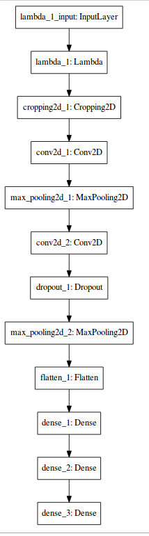
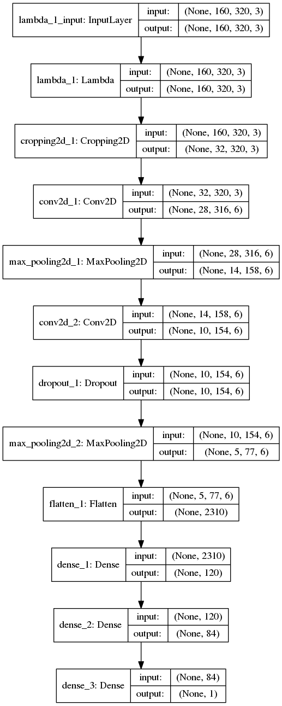

# **Behavioral Cloning** 


---

**Behavioral Cloning Project**

The goals / steps of this project are the following:
* Use the simulator to collect data of good driving behavior
* Build, a convolution neural network in Keras that predicts steering angles from images
* Train and validate the model with a training and validation set
* Test that the model successfully drives around track one without leaving the road
* Summarize the results with a written report


## Rubric Points
### Here I will consider the [rubric points](https://review.udacity.com/#!/rubrics/432/view) individually and describe how I addressed each point in my implementation.  

---
### Files Submitted & Code Quality

#### 1. This repo includes all required files and can be used to run the simulator in autonomous mode

 This repo includes the following files:
* model.py containing the script to create and train the model
* drive.py for driving the car in autonomous mode
* model.h5 containing a trained convolution neural network 
* writeup_report.md or writeup_report.pdf summarizing the results

#### 2. Submission includes functional code
Using the Udacity provided simulator and my drive.py file, the car can be driven autonomously around the track by executing 
```sh
python drive.py model.h5
```

#### 3. Submission code is usable and readable

The model.py file contains the code for training and saving the convolution neural network. The file shows the pipeline I used for training and validating the model, and it contains comments to explain how the code works.

### Model Architecture and Training Strategy

#### 1. LeNet model architecture has been employed

Modes is derived from LeNet architecure, here is a detailed view of architecture employed:




The model includes RELU layers to introduce nonlinearity (code line 20), and the data is normalized in the model using a Keras lambda layer (code line 18). 

#### 2. Attempts to reduce overfitting in the model

The model contains dropout layers in order to reduce overfitting (model.py lines 99). 

L1 and L2 regularization is implemented and played with, but not included in final model.

The model was tested by running it through the simulator and ensuring that the vehicle could stay on the track.

#### 3. Model parameter tuning

The model used an adam optimizer, so the learning rate was not tuned manually (model.py line 25).

#### 4. Appropriate training data

Training data was chosen to keep the vehicle driving on the road. I used a combination of center lane driving, recovering from the left and right sides of the road.

For details about how I created the training data, see the next section. 

### Model Architecture and Training Strategy

#### 1. Solution Design Approach

The overall strategy for deriving a model architecture was to start from a tried and tested model from project 2 and then play with the architecture. I did not have to modify architecture much.

My first step was to use a convolution neural network model similar to the I used for Traffic sign classifier (LeNet variant). 

In order to gauge how well the model was working, I split my image and steering angle data into a training and validation set. I found that my first model had a low mean squared error on the training set but a high mean squared error on the validation set. This implied that the model was overfitting. 

At this stage, the car would get stuck at the dirt road exit:


Then after some variation to model, it would actually take the dirt road exit:


To combat the overfitting, I added dropout and played with L1/L2 regularization.

The final step was to run the simulator to see how well the car was driving around track one. There were a few spots where the vehicle fell off the track. To improve the driving behavior in these cases, I augmented data and trained more epochs.

At the end of the process, the vehicle is able to drive autonomously around the track without leaving the road. Complete lap:


#### 2. Final Model Architecture

The final model architecture (model.py lines 82-111) consisted of a convolution neural network with the following layers and layer sizes:




#### 3. Creation of the Training Set & Training Process

I first trained the model on sample data supplied by udacity. When I tested this model in simulator, it would leave road on a specific patch of track where there was a dirt patch exit. So I augmented the data by recording the vehicle recovering from the left side and right sides of the road back to center so that the vehicle would learn to steer away from edges when necessary.

Since track 1 was mostly curved towards left, I augmented the data set by flipping images and angles thinking that this would help generalize on curves on either sides of road.


After the collection process, I had 18191 number of data points. I then preprocessed this data by cropping out 35% top rows and 5% bottom rows to exclude unnecessary skyline and dashboard portion of image.

I finally randomly shuffled the data set and put 20% of the data into a validation set. 

I used this training data for training the model. The validation set helped determine if the model was over or under fitting. I trained the model with incremental layes and used total epochs around 30 as evidenced by performance in simulator. I used an adam optimizer so that manually training the learning rate wasn't necessary.


```python

```
